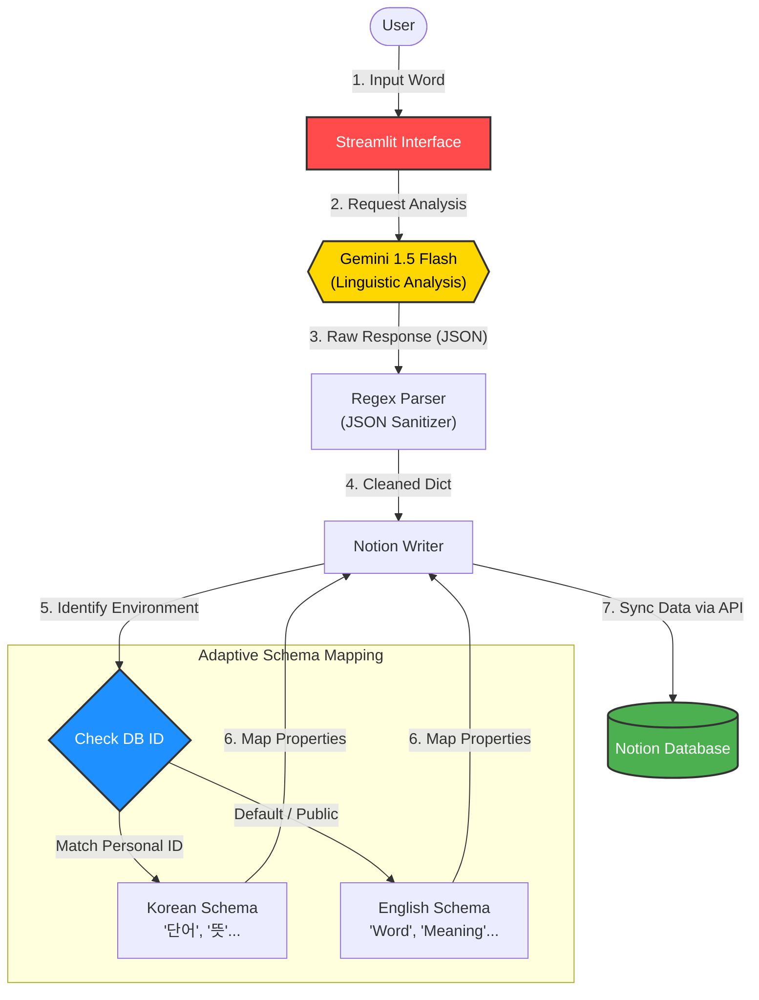

# 📋 JP-Dictionary-Bot

An AI-powered automation tool that streamlines Japanese language learning by syncing contextualized vocabulary data (JLPT level, nuances, and IT/Business examples) to Notion using Gemini AI

## 🎯 Background & Motivation
- **The Context**
  - Preparing for employment in the Japanese IT market requires not just memorizing words, but understanding their specific nuances and usage in professional contexts

- **The Problem**
  1. High Friction in Organization: Manually copying words, looking up kanji/furigana, and pasting them into Notion is time-consuming and disrupts the learning flow

  2. Lack of Context: Simple dictionary definitions often miss the "nuance" (how the word is actually used in Japan) and the appropriate JLPT difficulty level

  3. Data Inconsistency: Managing different database structures for personal use (Korean-based) and global sharing (English-based) creates maintenance overhead

- **The Solution**
  1. One-Click Sync Pipeline: Built a system where a single word input triggers a complete linguistic analysis and immediate Notion sync

  2. AI-Driven Contextualization: Leveraged Gemini AI to generate IT/Business-focused examples and nuance tips optimized for the user's target JLPT level

  3. Adaptive Schema Mapping: Implemented an environment-aware logic that automatically switches between Korean and English database schemas based on the Database ID

- **Data Source**: User Input (Streamlit Interface), Gemini AI Analysis

- **Key Columns**
  1. Word
  2. Furigana
  3. Meaning
  4. Status
  5. Level
  6. Example
  7. Translation
  8. Nuance

- **JP-Dictionaty-bot Architecture (Mermaid)**


## 🛠 Tech Stack
- **Language**: 
- **Database**:   | API
- **AI/LLM**:  | API
- **UI Framework**: 
- **Communication**: Requests
- **Deployment** :  | Cloud
- **Security**:  | Secrets  

## ✅ Milestone
- **Phase 1**: Foundation & Environment Setup
  - [x] Phase 1-1: Initialize GitHub Repository & Project Board
  - [x] Phase 1-2: Design Notion Database Schema
  - [x] Phase 1-3: API Authorization & Security Setup(Notion, Gemini API & .env)
  - [x] Phase 1-4: Setup Python Development Environment(requirements.txt)

- **Phase 2**: Core Business Logic Development
  - [x] Phase 2-1: Translation & Data Extraction Module
  - [x] Phase 2-2: Gemini Prompt Engineering
  - [x] Phase 2-3: Data Parsing Module
  - [x] Phase 2-4: Local Integration Testing

- **Phase 3**: Notion Integration & Data Storage
  - [x] Phase 3-1: Develop Notion API Wrapper
  - [x] Phase 3-2: Data Mapping Logic
  - [x] Phase 3-3: Duplicate Prevention & Tracking Logic
  - [x] Phase 3-4: Exception Handling

- **Phase 4**: Productization & Web Interface Development
  - [x] Phase 4-1: Web UI Conversion (Streamlit/Web Framework)
  - [x] Phase 4-2: Dynamic Authentication & Session Management
  - [x] Phase 4-3: Batch Processing & Progress Visualization
  - [x] Phase 4-4: User Preference Persistence (Optional)
  - [x] Phase 4-5: Multi-language Support

- **Phase 5**: Deployment, Documentation & Portfolio Finalization
  - [x] Phase 5-1: Cloud Deployment
  - [x] Phase 5-2: Comprehensive User Documentation
  - [x] Phase 5-3: Code Refactoring & Security Audit
  - [x] Phase 5-4: Global Localization & UX Optimization 
  - [x] Phase 5-5: Adaptive Multi-Schema & Environment Isolation
  - [x] Phase 5-6: Final Project Retrospective

## 🔥 Troubleshooting & Lessons Learned
**1. AI Output Stability (Handling Non-JSON Responses)**
  - **Challenge**: The AI occasionally included markdown backticks (```json) or conversational text, causing json.loads() to fail.

  - **Resolution**: Implemented a defensive prompt engineering strategy and a robust parser that extracts only the valid JSON block from the raw string.

**2. Dynamic Database Schema Mapping**
  - **Challenge**: Supporting both personal (Korean headers) and public (English headers) Notion templates without duplicating code.

  - ***Resolution**: Designed a Schema-Switching Logic that detects the database_id and maps internal data keys to the appropriate database property names dynamically.

**3. Robust Duplicate Management**

  - **Challenge**: Preventing redundant entries while ensuring the system remains fast.

  - **Resolution**: Developed a pre-sync check using the Notion Query API to identify existing entries and provide a direct link to the user instead of creating duplicates.

## 📈 Results
- **Efficiency**: Reduced the time to log a single word with full context from ~3 minutes to under 5 seconds.
- **Quality of Learning**: Provided a consistent learning environment with IT-focused examples, directly supporting career goals in the Japanese tech industry.

🧐 Self-Reflection
- **Technical Growth**
  - **System Design**: Learned to build a "Production-ready" app by implementing environment-based configuration and error-masking.

  - **Global Mindset**: Realized the importance of Localization and how to architect a codebase that supports multiple languages from the start.

- **Problem-Solving Mindset**
  - **Bridge Builder**: Confirmed that the best software solutions come from automating personal pain points to provide value to a wider community.

## 🧐 Final Project Retrospective (The "Story")

### 💡 The Core Philosophy: "Automation with Empathy"
This project began with a personal pain point: the high friction of organizing vocabulary while preparing for the Japanese IT market. However, through the development process, it evolved into a mission to build a **"resilient bridge"** between human intent and AI execution.

### 🚀 Key Technical Evolution
1. **Engineering for Uncertainty**: One of the biggest challenges was the "hallucination" and formatting inconsistency of LLMs. By implementing a **Defensive Regex Parser**, I moved away from "hoping the AI works" to "structurally ensuring the data works."

2. **Architecting for Versatility**: The transition from a hard-coded Korean system to an **Adaptive Multi-Schema** architecture was a pivotal moment. It taught me that global-ready software isn't just about translating UI strings; it's about designing data structures that respect the user's local context.

### 🌏 Career Alignment & Growth
Building **JP-Dictionary-Bot** has solidified my identity as a developer who can:
- Identify inefficiencies in personal and professional workflows.
- Architect scalable, localized solutions using modern AI stacks.
- Maintain a "Security-First" and "User-Centric" mindset throughout the development lifecycle.

### 🏁 Closing Thoughts
This project is more than just a tool for learning Japanese; it is a testament to my growth as a **Full-Stack Problem Solver**. As I prepare to enter the Japanese IT market, I am confident that the engineering patterns and the "Global Pivot" I've experienced here will serve as a strong foundation for solving complex, real-world problems.

## ✨ Contact
- **GitHub Repository**: https://github.com/2daKaizen-gun/jp-dict-bot

- **Email**: hkys1223@naver.com